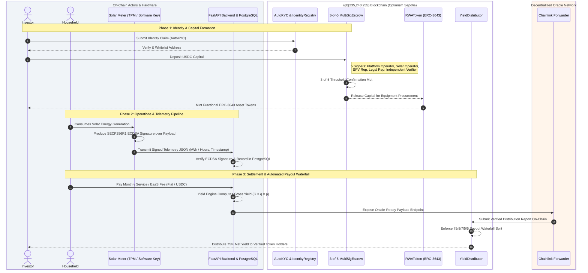

# Veridian System Architecture and Lifecycle Sequence

This document describes the end-to-end technical, legal, and economic architecture for **Veridian**: a tokenized solar infrastructure financing platform in South Africa.

---

## 1. High-Level Architecture Overview

Veridian integrates three primary layers:
1. **Off-Chain Hardware & Backend Services**: Solar meters with Hardware Root of Trust (TPM), FastAPI backend, and PostgreSQL database.
2. **On-Chain Smart Contracts (Optimism Sepolia)**: ERC-3643 compliant asset tokens (`RWAToken.sol`), 3-of-5 Multisig Escrow (`MultiSigEscrow.sol`), Identity & Compliance Registry (`IdentityRegistry.sol`), and Automated Distribution (`YieldDistributor.sol`).
3. **Decentralized Oracle Network (Chainlink)**: Chainlink Functions / Forwarders for verified off-chain to on-chain telemetry and yield report delivery.

---

## 2. System Architecture & Lifecycle Sequence Diagram

---

## 3. Payout Waterfall Breakdown

| Component | Share | Description |
| :--- | :--- | :--- |
| **Investors** | **75%** | Return on capital and asset performance risk compensation. |
| **Operations & Maintenance (O&M)** | **8%** | Routine maintenance and field servicing. |
| **Reserves & Insurance** | **7%** | Equipment failure insurance, reserves, and depreciation. |
| **Pool Expansion** | **5%** | Reinvestment in future solar array deployments. |
| **Platform Operations** | **5%** | Software, compliance, administrative, and oracle maintenance. |
