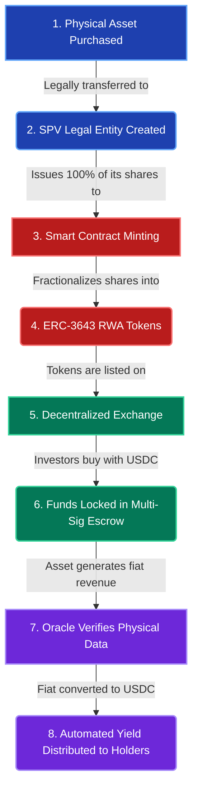

# Clearer Visualizations: Lifecycle & Sequence

The best way to explain complex blockchain architectures to an audience is by breaking them down into **Chronological Steps** (for the economics) and **Sequence Diagrams** (for the tech). 

Here are two vastly improved, easier-to-read maps that tell a story instead of just showing a tangled web of connections.

---

## 1. The Tokenization Lifecycle (Economics & Ownership)
*Why this is better:* Instead of a confusing web of boxes, this flowchart reads like a story from start to finish. It takes the audience step-by-step from the physical real-world purchase all the way to the investor getting paid.

---

## 2. Technical Execution Flow (Architecture)
*Why this is better:* A sequence diagram is the industry standard for showing software architecture. It shows **time and order of operations**. Your audience can clearly see exactly what the user does, how the blockchain reacts, and how the Python backend bridges the gap in the background.

```mermaid
sequenceDiagram
    autonumber
    
    actor Investor
    participant Frontend as Next.js dApp
    participant KYC as Auto-KYC Contract
    participant Market as AMM Exchange
    participant Escrow as Multi-Sig Escrow
    participant Backend as FastAPI Oracle

    %% Onboarding Phase
    rect rgb(20, 20, 30)
    Note over Investor,KYC: Phase 1: Compliance & Onboarding
    Investor->>Frontend: Connects Wallet & Requests Verification
    Frontend->>KYC: Submit Identity Claim (Zero Knowledge)
    KYC-->>Frontend: Whitelisted in Identity Registry
    end
    
    %% Trading Phase
    rect rgb(30, 20, 20)
    Note over Investor,Escrow: Phase 2: Asset Acquisition
    Investor->>Frontend: Swap USDC for RWA Token
    Frontend->>Market: execute swap() transaction
    Market->>Escrow: Lock USDC securely in Escrow
    Market-->>Investor: Transfer RWA Fractional Tokens
    end
    
    %% Yield Phase
    rect rgb(20, 30, 20)
    Note over Backend,Investor: Phase 3: Off-Chain Oracle & Yield
    loop Continuous Lifecycle
        Backend->>Backend: Read Physical Hardware Telemetry
        Backend->>Escrow: Submit Cryptographic Proof of Revenue
        Escrow->>Escrow: Threshold Met (Multi-Sig Consensus Reached)
        Escrow-->>Investor: Distribute USDC Yield to Wallets
    end
    end
```

