# Veridian: Comprehensive Architecture & Execution Map

This document provides a unified "God-Mode" view of the Veridian platform. It maps the exact chronological flow across all four user portals, the physical hardware, the off-chain oracle, and the on-chain smart contracts.

## Complete Protocol Lifecycle

```mermaid
sequenceDiagram
    autonumber
    
    %% Actors
    actor Lessee as Household (Lessee)
    actor Admin as SunFix Logistics (Admin)
    actor Investor as Retail Investor
    
    %% UI Hubs
    box rgb(30, 41, 59) Frontend Portals
    participant LPortal as Household Portal (/lessee)
    participant APortal as Operations Portal (/admin)
    participant IPortal as Investor Hub (/investor)
    participant MPortal as Command Center (/map)
    end
    
    %% Hardware & Off-chain
    box rgb(63, 63, 70) Off-Chain Infrastructure
    participant TPM as TPM 2.0 Hardware (Simulated)
    participant Oracle as Chainlink / FastAPI (Simulated)
    end
    
    %% Smart Contracts (Optimism Sepolia)
    box rgb(17, 24, 39) Optimism Sepolia (L2)
    participant KYC as Midnight (zk-KYC) (Proposed)
    participant Factory as RWAFactory
    participant ERC3643 as ERC-3643 Token
    participant DAO as DAO Governor
    participant Escrow as Multi-Sig Escrow
    end

    %% Phase 1: Physical Installation & Asset Issuance
    rect rgb(20, 30, 20)
    Note over Lessee,Factory: Phase 1: Installation & Token Issuance
    Lessee->>LPortal: Submit Installation Request
    LPortal->>Admin: Alert SunFix Logistics
    Admin->>TPM: Install Solar Panels & TPM Hardware
    TPM-->>Oracle: Cryptographic Handshake (Hardware Verified)
    Oracle-->>APortal: Hardware Status: Online
    Admin->>APortal: Click "Issue Asset"
    APortal->>Factory: deployAsset()
    Factory->>ERC3643: Mint Fractional Tokens representing SPV
    Factory->>DAO: Deploy specific DAO for Asset
    end
    
    %% Phase 2: Investor Onboarding & Acquisition
    rect rgb(30, 20, 20)
    Note over Investor,Escrow: Phase 2: Compliance & Investment
    Investor->>IPortal: Connect Wallet & Request KYC
    IPortal->>KYC: Generate zk-SNARK Proof of Identity
    KYC-->>ERC3643: Update IdentityRegistry (Whitelisted)
    Investor->>IPortal: Swap USDC for Veridian Tokens
    IPortal->>ERC3643: Execute Transfer (canTransfer=true)
    ERC3643->>Escrow: Lock USDC in Escrow
    ERC3643-->>Investor: Tokens Received in Wallet
    Investor->>IPortal: Stake Tokens in Vault (75% Yield Bracket)
    IPortal->>DAO: Grant Governance Voting Power
    end
    
    %% Phase 3: Telemetry & Decentralized Yield Settlement
    rect rgb(20, 20, 30)
    Note over Lessee,Escrow: Phase 3: Physical Revenue & Split (75/8/7/5/5)
    TPM->>Oracle: Stream Live Generation Telemetry (kWh)
    Oracle->>MPortal: Render Live Node Data on Global Map
    Lessee->>LPortal: View Savings & Pay Monthly Bill (e.g., R498)
    LPortal->>Oracle: Confirm Fiat/Stablecoin Revenue Received
    Oracle->>Escrow: triggerYieldDistribution()
    
    Note over Escrow,Investor: Smart Contract Revenue Waterfall Execution
    Escrow->>Escrow: 5% Retained (Platform Operations)
    Escrow->>Escrow: 5% to Expansion Fund (Underwrite new arrays)
    Escrow->>Escrow: 7% to Insurance & Reserve
    Escrow->>Admin: 8% to SunFix Logistics (O&M)
    Escrow-->>Investor: 75% Distributed to Staked Wallets
    end
```

### Explaining the Map to Judges

- **The Flow follows reality:** It starts with a real household requesting real hardware (Phase 1), moves to the financial markets for funding (Phase 2), and ends with the physical energy generating a trustless payout (Phase 3).
- **The "God-Mode" view:** This sequence diagram specifically highlights how the 4 disparate Next.js portals you built (`/lessee`, `/admin`, `/investor`, `/map`) actually talk to each other through the shared backbone of the blockchain and the Chainlink oracle.
